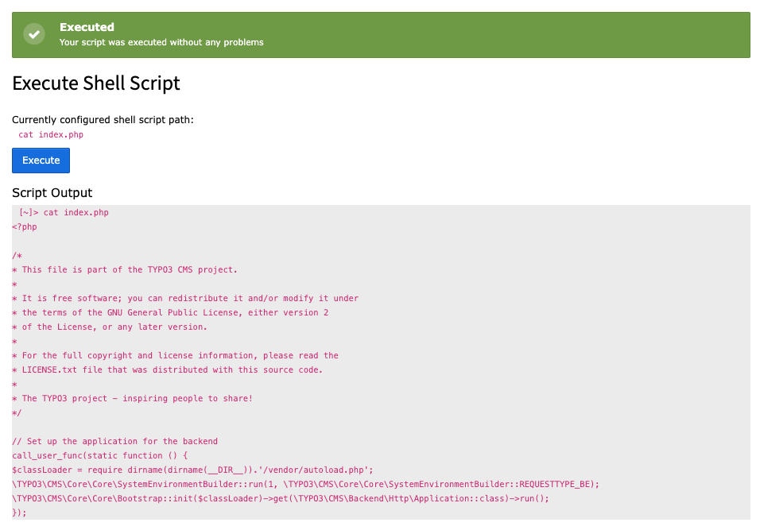
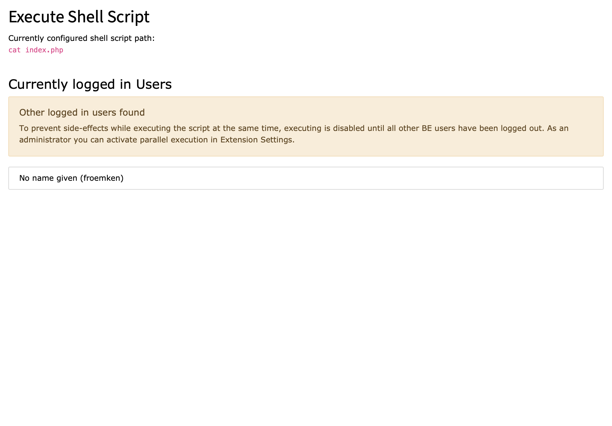

..  include:: /Includes.rst.txt

..  _introduction:

============
Introduction
============

..  _what-it-does:

What does it do?
================

With `jw_shell_exec` you can configure just ONE shell script which
also non-admin BE users can execute (if he has rights to access the
BE module).

By default parallel execution of the script will be prevented, but as
an administrator you still can allow parallel execution.

Examples
========

Backup
------

Let you BE users decide when it's time to start the configured backup script.

Import
------

Add a possibility for your BE users to start the configured import script.

Last three log entries
----------------------

Set the shell script to show the last 3 lines of the TYPO3 log:

..  code-block:: bash

    tail -n 3 /var/www/html/var/log/typo3_61d7538bf5.log

Show content of a file
----------------------

Set the shell script to show the content of a file:

..  code-block:: bash

    cat /var/www/html/index.php

Execute typo3 commands
----------------------

In most cases your BE users does not have access to `scheduler` module,
but with `jw_shell_exec` you can let your BE users execute a TYPO3
command:

..  code-block:: bash

    typo3 scheduler:run

Screenshots
===========

See `jw_shell_exec` in action.

Execute Command
---------------

This is an example output of the BE module of `jw:shell_exec`. As you can
see there is no possibility for an editor to change the configured shell
script. There is just one button to execute the command and the job is done.

After execution you will see the command output.

Prevent Parallel Execution
--------------------------

By default it is not possible to execute a shell script, if another
BE editor/admin is currently logged-in to TYPO3 BE. That prevents parallel
executions of the shell script which may result into
unwished side-effects.

Since version 3.0.0 you, as an admin, can activate parallel execution
in extension settings

          in TYPO3 backend.
